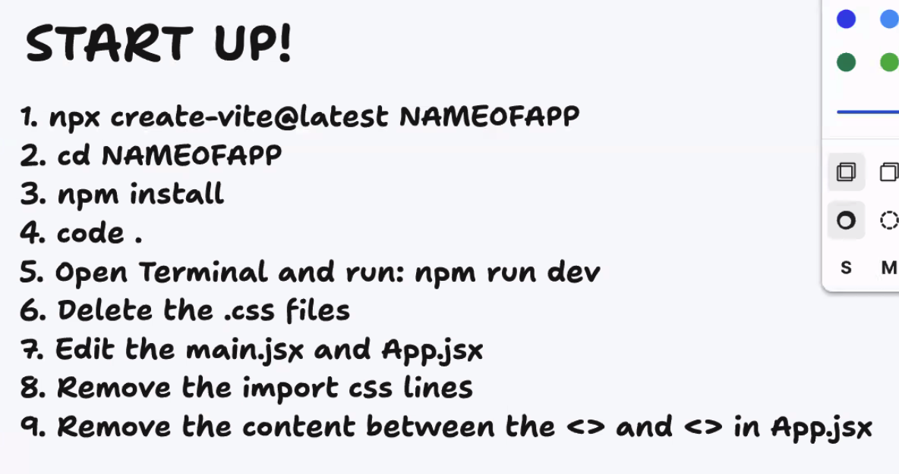

# **Home**

## Overview

To organize reading notes for Code Fellows Class 102, Class 201, Class 301, and Class 401. Please see the table of contents below for each specific lesson's reading notes.

## Personal Introduction

My name is Evan Cheng, I am a creative designer with a focus in graphic design and photography. Prior to starting my software development journey, I was a public affairs specialist and combat cameraman in the US Army.

## Table of Contents

A.  **Class - Code 102 - Intro to Software Development Reading Notes**

1. [102.001](./code-102/code-102-class-001.md)
2. [102.002](./code-102/code-102-class-002.md)
3. [102.003](./code-102/code-102-class-003.md)
4. [102.004](./code-102/code-102-class-004.md)
5. [102.005](./code-102/code-102-class-005.md)
6. [102.006](./code-102/code-102-class-006.md)
7. [102.007](./code-102/code-102-class-007.md)
8. [102.008](./code-102/code-102-class-008.md)

---

B. **Class - Code 201 - Foundations of Software Development Reading Notes**

1. [201.001](./code-201/code-201-class-001.md)
2. [201.002](./code-201/code-201-class-002.md)
3. [201.003](./code-201/code-201-class-003.md)
4. [201.004](./code-201/code-201-class-004.md)
5. [201.005](./code-201/code-201-class-005.md)
6. [201.006](./code-201/code-201-class-006.md)
7. [201.007](./code-201/code-201-class-007.md)
8. [201.008](./code-201/code-201-class-008.md)  
1. [201.009](./code-201/code-201-class-009.md)
2. [201.010](./code-201/code-201-class-0010.md)
3. [201.011](./code-201/code-201-class-0011.md)
4. [201.012](./code-201/code-201-class-0012.md)
5. [201.013](./code-201/code-201-class-0013.md)
6. [201.014](./code-201/code-201-class-0014.md)
7. [201.015](./code-201/code-201-class-0015.md)  

#### [201 Class Format](./code-201/code-201-class-format.md)

#### [201 Pre-work: Ai Prompt & Response Assignment](./code-201/prompt-engineering.md)  

#### [201 Things I Want To Know More About](./code-201/things-i-want-to-know-more-about.md)  

---

C. **Class - Code 301 - Intermediate Software Development Reading Notes**  

1. [301.001](./code-301/code-301-class-001.md)
2. [301.002](./code-301/code-301-class-002.md)
3. [301.003](./code-301/code-301-class-003.md)
4. [301.004](./code-301/code-301-class-004.md)
5. [301.005](./code-301/code-301-class-005.md)
6. [301.006](./code-301/code-301-class-006.md)
7. [301.007](./code-301/code-301-class-007.md)
8. [301.008](./code-301/code-301-class-008.md)
9. [301.009](./code-301/code-301-class-009.md)  
10. [301.010](./code-301/code-301-class-0010.md)
11. [301.011](./code-301/code-301-class-0011.md)
12. [301.012](./code-301/code-301-class-012.md)
13. [301.013](./code-301/code-301-class-013.md)
14. [301.014](./code-301/code-301-class-014.md)

#### [301 Things I Want To Know More About](./code-301/things-i-want-to-know-more-about.md)

#### React Start Up Instructions

#### 

---

D. **Class - Code 401 - Advanced Software Development Reading Notes**

1. [401.001](./code-401/code-401-class-001.md)
2. [401.002](./code-401/code-401-class-002.md)
3. [401.003](./code-401/code-401-class-003.md)
4. [401.004](./code-401/code-401-class-004.md)
5. [401.005](./code-401/code-401-class-005.md)
6. [401.006](./code-401/code-401-class-006.md)
7. [401.007](./code-401/code-401-class-007.md)
8. [401.008](./code-401/code-401-class-008.md)
9. [401.009](./code-401/code-401-class-009.md)  
10. [401.010](./code-401/code-401-class-0010.md)
11. [401.011](./code-401/code-401-class-0011.md)
12. [401.012](./code-401/code-401-class-012.md)
13. [401.013](./code-401/code-401-class-013.md)
14. [401.014](./code-401/code-401-class-014.md)
15. [401.015](./code-401/code-401-class-015.md)
16. [401.016](./code-401/code-401-class-016.md)
17. [401.017](./code-401/code-401-class-017.md)
18. [401.018](./code-401/code-401-class-018.md)
19. [401.019](./code-401/code-401-class-019.md)
26. [401.026](./code-401/code-401-class-026.md)
31. [401.31](./code-401/code-401-class-031.md)

#### [401 Things I Want To Know More About](./code-401/things-i-want-to-know-more-about.md)
#### [Practice In The Terminal](./code-401/practice-in-the-terminal.md)  
#### [SQL Practice](./code-401/sql-practice.MD)
#### 401 Growth Mindest Bookmarks

[Upgrade Your Technical Skills with Deliberate Practice](https://web.archive.org/web/20160616225417/http://www.happybearsoftware.com/upgrade-your-technical-skills-with-deliberate-practice)  
[Carol Dweck on the Growth Mindset](https://www.ted.com/talks/carol_dweck_the_power_of_believing_that_you_can_improve?language=en)  
[Angela Lee Duckworth on Grit](https://www.ted.com/talks/angela_lee_duckworth_grit_the_power_of_passion_and_perseverance)  
[Alain de Botton on Redefining Success](https://www.ted.com/talks/alain_de_botton_a_kinder_gentler_philosophy_of_success)  
  
#### Assessing Emotional Intelligence
Self-Awareness Score: 22  

Self-Management Score: 20  

Social Awareness Score: 22  

Relationship Management Score: 21

After taking this assessment, I am not shocked by the results, however I did find the individual questions helpful in analyzing past interactions with others and also reflecting on my overall ability to handle situations. In particular, question 13 produced my lowest score. The question was: "I am able to honestly say how I feel without getting others upset." This might not be the right response, but I gave this a 3 rating, because I felt that the outcome of this was subjective. I believe, within reason, being honest to others about how you feel shouldn't be dependent on how others feel. In an instance where someone is upset about your honesty, they might be more upset about the delivery of that honesty, versus the actual reason why you feel a certain way. Therefore, you should always aim to be honest about how you feel towards others, but remember to deliver that feeling in a way that is respectful and maybe even empathetic. 

#### Assessing Biases
According the Bias Assessment, my highest score is in the "What is Bias" category, with a score of 14. My lowest score was in the "Connect to Mitigate bias" category, with a score of 11. One aspect of this test that I liked and can agree with was the statement: "But this is not a topic you ever master. You should continue your journey in this area by examining where you still have room for improvement". Even though I have a high self-awareness or understanding of this concept, does not make me a master or perfect at responding to all kinds of situations. If anything, it  means that I have even more of a responsibility and accountability to self, in order to reduce bias from myself and bias from others. In the assessment, I said that I would like to focus on the following areas:  "EMPATHY AND CURIOSITY, CONNECT TO MITIGATE BIAS". Specifically, I need the support and input of others to be able to see past my own biases and assumptions, and not rely on myself.
