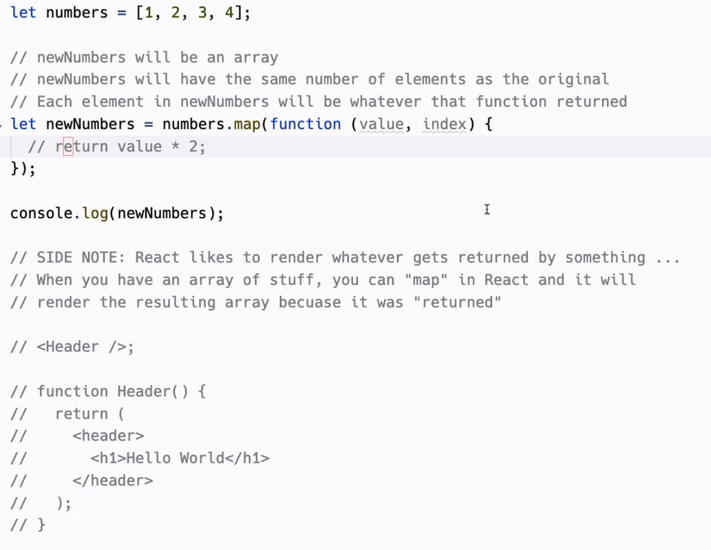
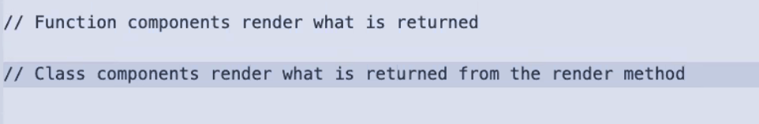
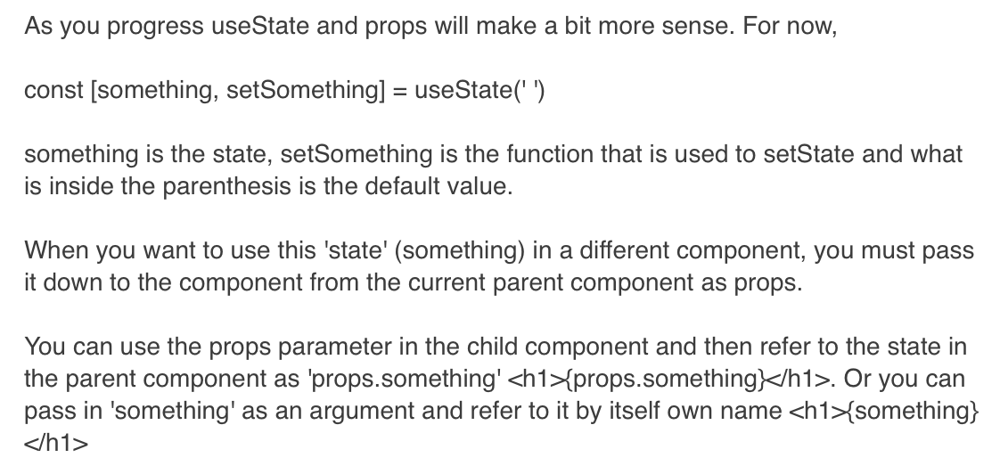
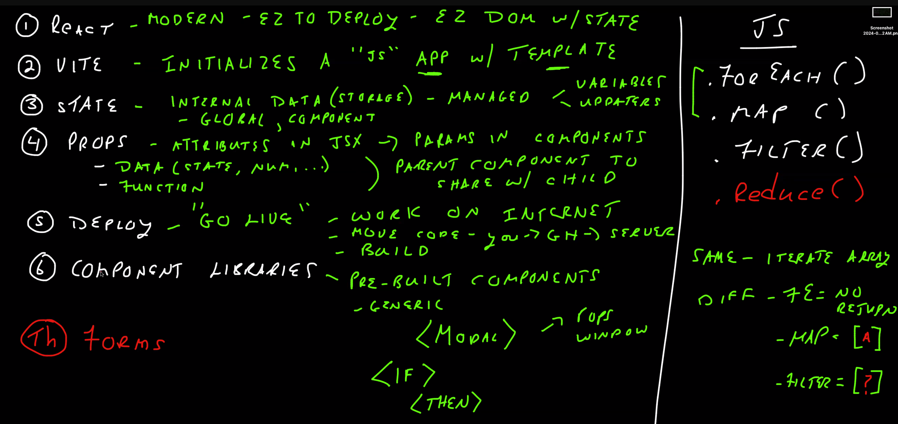
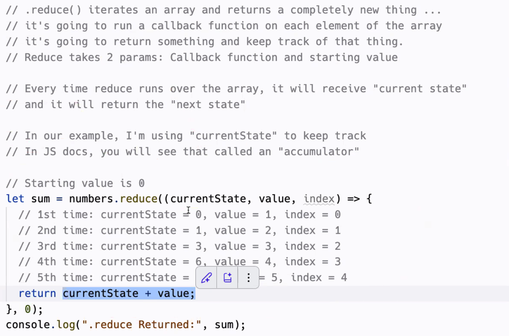

## Prep: Things I Want To Know More About

## 26 March 2024 - Class 002

### For Loops &  Array Review  

**Index:** position in array  
**Value:** data in element/array

**forEach:** Loops over an array for each index/value, then executes callBack function.

    In essence, forEach is a For Loop without having to write the entire For loop.

**callBack Function:** functions that are deployed after the first function completes its task. callback functions are for sequence control.

    The function itself does not have to be named "callback"; you can use any valid identifier as the name for the function. The term "callback" typically refers to the concept rather than a specific function name. You can name your callback functions according to their purpose or what they represent in your code.

    For example, if you have a function that is called when a button is clicked, you might name it something like "handleButtonClick" or "onClickHandler" rather than just "callback". The important thing is that it serves the purpose of being called back by another function at a later time.

**array.map**
Runs a callback function that gets value and index as parameters and returns an element that gets added to a new array.
returns a new array the same size as the original.

**map:** iterates the array and returns something. When you need a new array.

**forEach:** iterates the array and does not return anything or returns undefined.

#### forEach callBack:
  
#### for loop & array:
  
#### map:

## 27 March 2024 - Class 003

  

## 28 MArch - Class 004

Review:  

Reduce Method: Returns a new array.

## 1 April - Class 006  
  
Function Chains:  

    Function chains in React refer to the process of composing multiple functions together to handle a sequence of operations or transformations, especially in the context of state management or side effects. This approach promotes the reuse of logic and the building of complex functionality from simpler, single-purpose functions. For example, in a React application, you might chain functions to format data, manage state transitions, or sequence side effects in response to user interactions or API calls.  

  Consider a scenario in a React application where you need to fetch data from an API, then filter and format this data before setting it to the state. Here, function chaining can be elegantly handled using async/await along with functional programming principles:

    const fetchDataAndProcess = async () => {
    try {
    const response = await fetch('https://api.example.com/data');
    const rawData = await response.json();
    
    // Chain 1: Filter the data
    const filteredData = rawData.filter(item => item.isActive);
    
    // Chain 2: Format the data
    const formattedData = filteredData.map(item => ({
      ...item,
      formattedDate: new Date(item.date).toLocaleDateString(),
    }));
    
    // Update state
    setState(formattedData);
    } catch (error) {
    console.error('Error fetching data:', error);
    }
    };

In this example, we start by fetching data asynchronously. Once we have the data (rawData), we first filter it (filteredData) and then format it (formattedData) before finally setting it to the component's state. Each step in this process can be considered a link in the function chain, handling a specific transformation or side effect.  
  
## 2 April - Class 007

  
 A 3-tier client-server architecture divides the application into three distinct layers, each responsible for specific aspects of the application's functionality:

    Presentation Layer (Client Tier): This is the user interface of the application, responsible for displaying data to the user and capturing user inputs. It communicates with the business logic layer to send requests and receive data, which it then presents to the user. This layer runs on the user's computer or web browser.
 
    Business Logic Layer (Application Tier): This layer processes user requests, performs operations, and makes logical decisions. It sits between the presentation and data layers, acting on the data before it is sent to the client or after it is received from the database. This layer runs on a server and is the core of the application, handling the execution of commands, making logical decisions, and performing calculations.

    Data Layer (Database Tier): This layer manages the storage and retrieval of data. It is responsible for data persistence, including databases, file systems, or any other storage mechanism. The data layer ensures that the application can access and store the data it needs to function correctly.

This architecture is widely adopted for its robustness, flexibility, and efficiency in managing complex, large-scale applications.

## 3 April - Class 008  
App Flow:
  

App Structure:

Two Server Flow:

