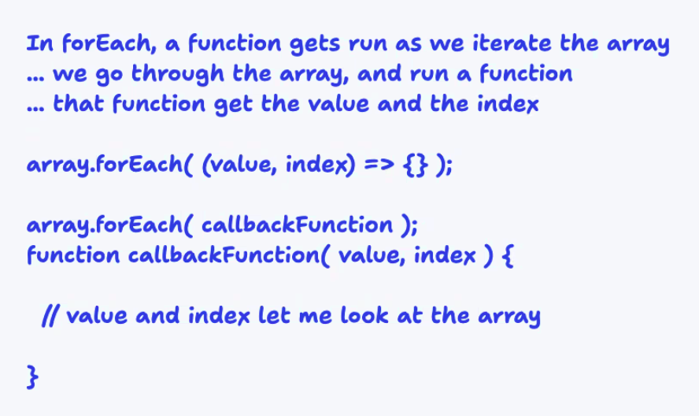
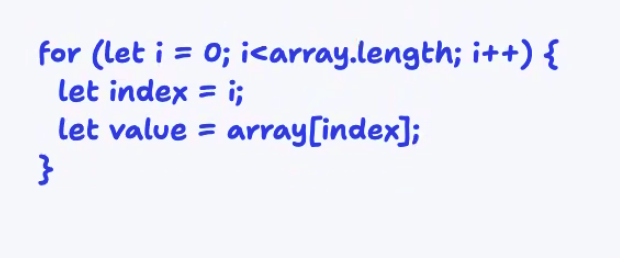

## Prep: Things I Want To Know More About

## 26 March 2024 - Class 002

### For Loops &  Array Review  

**Index:** position in array  
**Value:** data in element/array

**forEach:** Loops over an array for each index/value, then executes callBack function.

    In essence, forEach is a For Loop without having to write the entire For loop.

**callBack Function:** functions that are deployed after the first function completes its task. callback functions are for sequence control.

    The function itself does not have to be named "callback"; you can use any valid identifier as the name for the function. The term "callback" typically refers to the concept rather than a specific function name. You can name your callback functions according to their purpose or what they represent in your code.

    For example, if you have a function that is called when a button is clicked, you might name it something like "handleButtonClick" or "onClickHandler" rather than just "callback". The important thing is that it serves the purpose of being called back by another function at a later time.

**array.map**
Runs a callback function that gets value and index as parameters and returns an element that gets added to a new array.
returns a new array the same size as the original.

**map:** iterates the array and returns something. When you need a new array.

**forEach:** iterates the array and does not return anything or returns undefined.

#### forEach callBack:
  
#### for loop & array:
