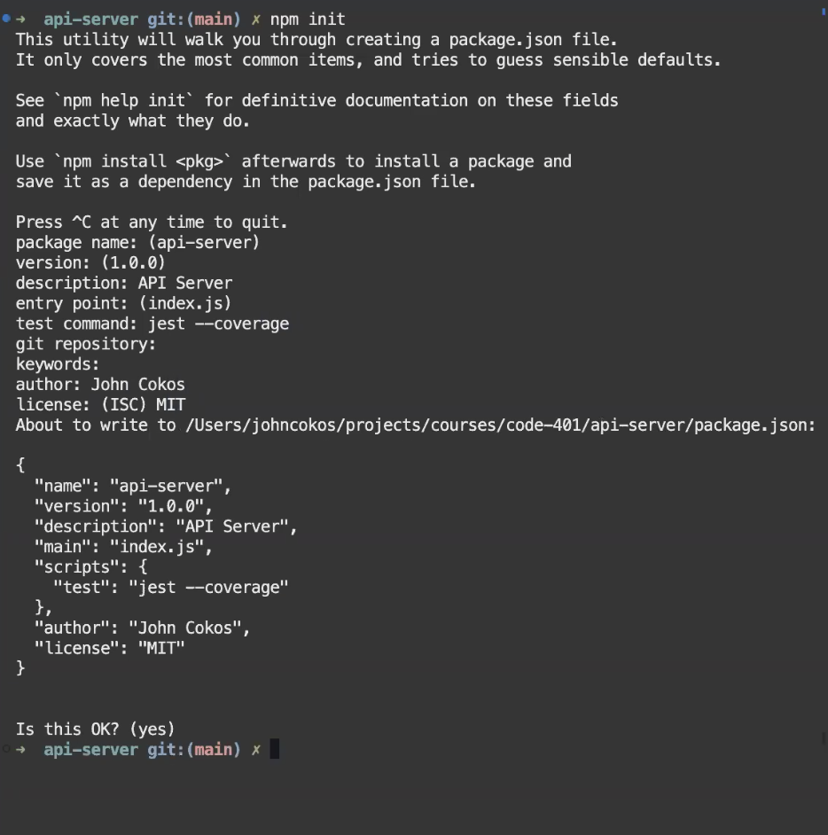

# 401 Things I Want To Know More About:

### Class Structure:

### Code Challenge Structure:

### NPM Init Steps and Structure:

Both encoding and encryption are used to transform data from one form to another, but they serve different purposes and have different use cases:

### Encoding:
- **Purpose**: Encoding is used to convert data into a specific format that is suitable for transmission or storage. It is not used for hiding information, but rather for ensuring data can be properly consumed by different types of systems.
- **Security**: Encoding does not provide security. It is reversible and the methods for encoding and decoding are widely known and accessible. Common examples include Base64, URL encoding, and ASCII.
- **Use Cases**: Encoding is commonly used when you need to ensure that data remains intact without modification during storage or transmission. For example, Base64 encoding is often used to encode binary data for inclusion in XML or JSON.

### Encryption:
- **Purpose**: Encryption is used to securely hide the content of data from unauthorized parties. It involves using algorithms and keys to transform readable data into an unreadable format that can only be deciphered by someone who has the corresponding decryption key.
- **Security**: Encryption provides a high level of security. It is intended to be reversible only if you have the appropriate decryption key. Without the key, decrypting the data should be extremely difficult or practically impossible.
- **Use Cases**: Encryption is crucial for protecting sensitive information, such as personal data, passwords, and financial information, especially when transmitting it over insecure networks like the internet.

In summary, encoding is about making data compatible or suitable for a different use, without the need for confidentiality, while encryption is specifically about securing data and ensuring it can only be accessed by authorized parties.

